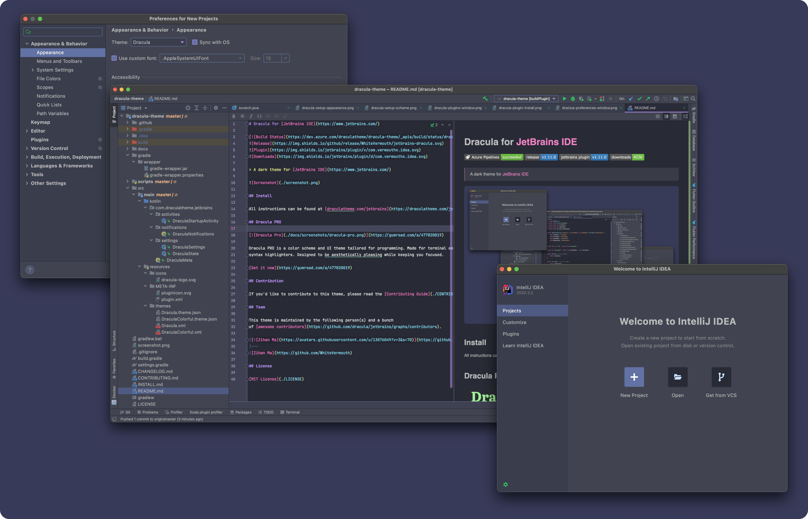

# Midnight Codex for [JetBrains IDE](https://www.jetbrains.com/)

> A dark theme for [JetBrains IDE](https://www.jetbrains.com/)

## Install

All instructions can be found at [midnight-codex.com/jetbrains](https://midnight-codex.com/jetbrains).

## Contribution

If you'd like to contribute to this theme, please read the [Contributing Guide](./CONTRIBUTING.md).

## Team

This theme is maintained by the following person(s) and a bunch
of [awesome contributors](https://github.com/rmnsnc/midnight-codex-jetbrains/graphs/contributors).

| ](https://github.com/rmnsnc) |
|------------------------------------------------------------------------------------------------------------|
| [Julien Hora](https://github.com/rmnsnc)                                                               |

## Community

- [Twitter](https://twitter.com/rmnsnc) - Best for getting updates about themes and new stuff.
- [GitHub](https://github.com/rmnsnc/midnight-codex/discussions) - Best for asking questions and discussing issues.

## License

[MIT License](./LICENSE)
